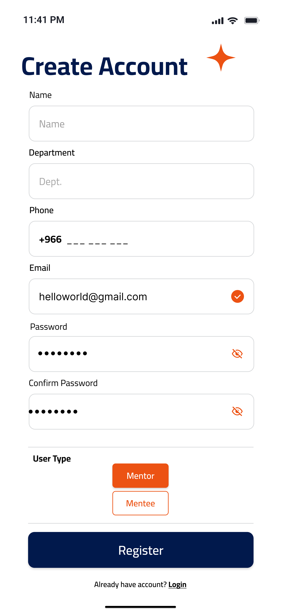
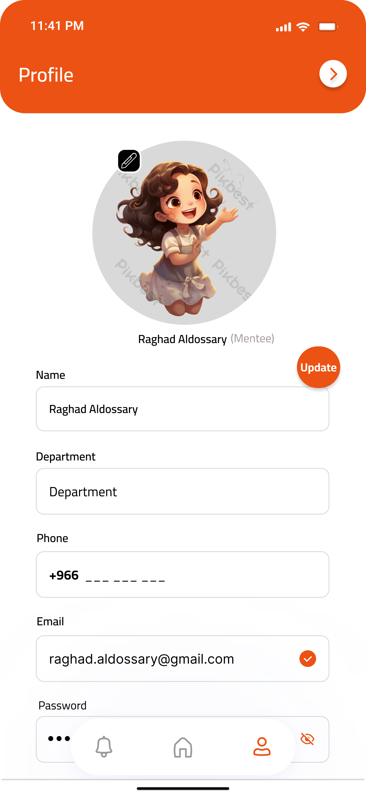
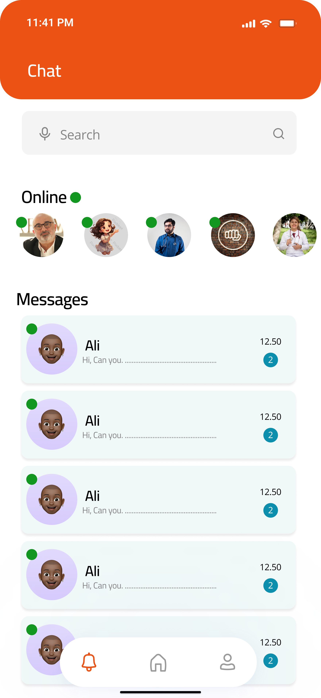
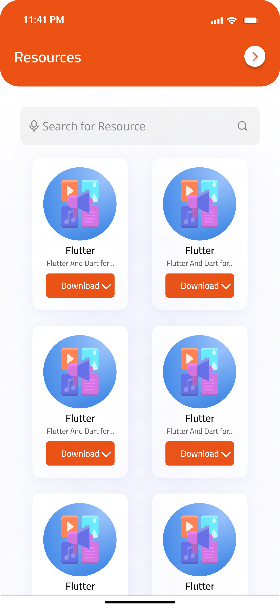

--
# PMUMentor

**PMUMentor** is an innovative application designed for the students of Prince Mohammad Bin Fahd University (PMU). It provides a mentorship platform that connects experienced students (mentors) with less experienced ones (mentees). The application aims to enhance academic success, offer professional guidance, and support personal development.

## Key Features
- **Communication and Mentorship**: User-friendly registration process and seamless mentor-mentee connections.
- **Resource Sharing**: Enables mentors to share study materials and professional opportunities.
- **Event Management**: Create and manage workshops and webinars.
- **Effective Notifications and Communication System**: Real-time messaging and interactive notifications.
- **Intuitive User Interface**: Easy-to-use design compatible with various devices.

## Technologies Used
- **Flutter**: For building a cross-platform application.
- **Firebase**: For cloud storage, authentication, and data management.
- **Node.js** or **Django**: For API services.

## System Screen

<p align="center">
  
  
  
</p>

---

<p align="center">
  
  
  
</p>

---

<p align="center">
  
  
  
</p>

---

## Download Project:
   ```bash
   git clone https://github.com/raghadhk/PMUMentor.git
   cd PMUMentor
   ```
